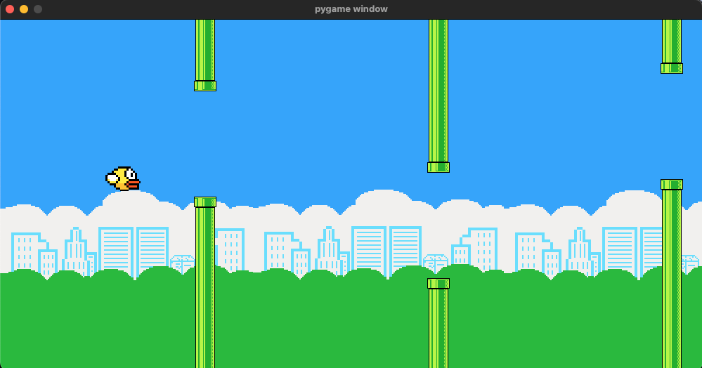

# flappy-clone-pygame



## Overview

Yet another flappy bird clone using pygame.

## Local Development

Setup venv and install dependencies

```
python -m venv .venv
source .venv/bin/activate
pip install -r requirements.txt
```

Start game

```
python game.py
```
